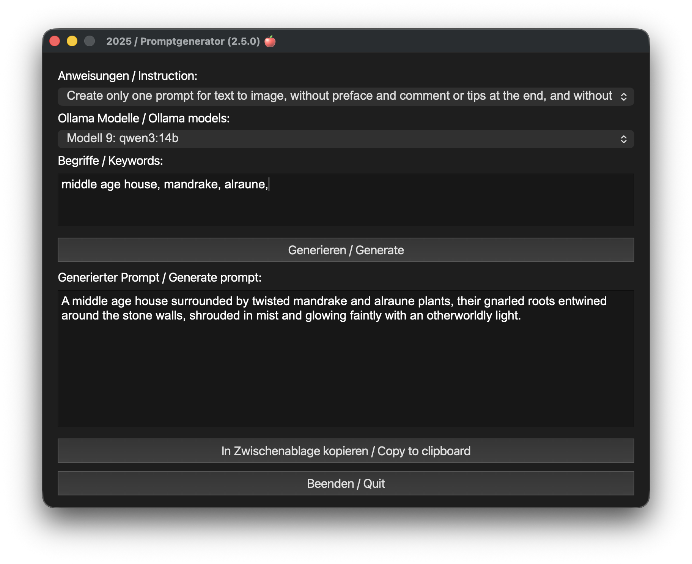
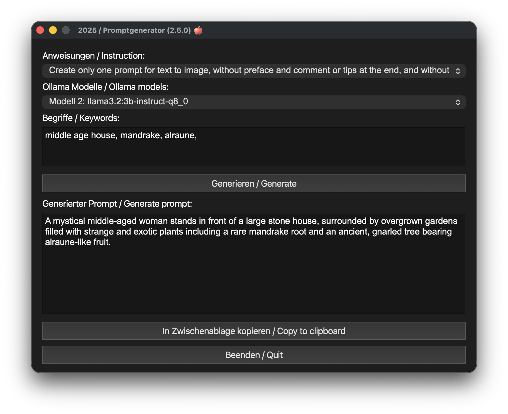

<div align=center><h1>Promptgenerator 2.5.1 with Ollama</h1></div>
<p align="center">
  
  
</p>

<p align="center">
  
  
</p>

Install Ollama
<http://ollama.com>

My Favorite LLM for this program<br>
llama3.2:3b-instruct-q8_0

```sh
ollama pull llama3.2:3b-instruct-q8_0
```

> Install Git
> <https://git-scm.com/downloads>

> Install Python
> <https://www.python.org/downloads/>

## Install, create python venv and start

```sh
git clone https://github.com/MarkusR1805/promptgenerator.git
python -m venv promptgenerator
source promptgenerator/bin/activate
cd promptgenerator
pip install -r requirements.txt
python main.py
```

# Attention, very important!

## If the program does not start or an error message appears, be sure to execute the requirements.txt.
